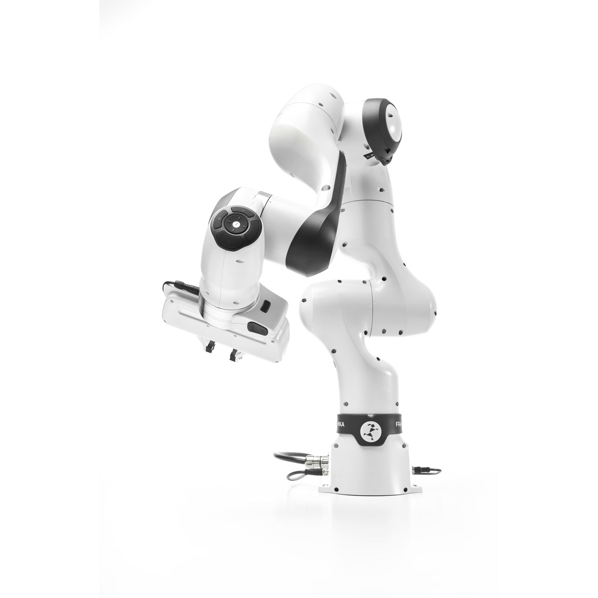

<!--
SPDX-FileCopyrightText: Alliander N. V.

SPDX-License-Identifier: Apache-2.0
-->

# RCDT Robotics

This repository gives an overview of the robots from RCDT and the different repositories developed for these robots.

**Robots:**

|  |  |
| :---------------------: | :--------------------: |
|    Franka Research 3    |    Husarion Panther    |

**General repositories:**

- [rcdt_docker](https://github.com/alliander-opensource/rcdt_docker)
- [rcdt_linting](https://github.com/alliander-opensource/rcdt_linting)
- [rcdt_utilities](https://github.com/alliander-opensource/rcdt_utilities)
- [rcdt_detection](https://github.com/alliander-opensource/rcdt_detection)

**Robot specific repositories:**

- [rcdt_franka](https://github.com/alliander-opensource/rcdt_franka)
- [rcdt_panther](https://github.com/alliander-opensource/rcdt_panther)
- [rcdt_mobile_manipulator](https://github.com/alliander-opensource/rcdt_mobile_manipulator)

**Forked repositories:**

- [franka_description](https://github.com/alliander-opensource/franka_description)

## General repositories

The following repositories are general repositories, used for all the robots.

**rcdt_docker:**

Contains scripts to generate different docker images for the different robots. This simplifies the process of installing the software requirements for every robot and makes switching between different robot systems easier.

**rcdt_linting:**

Contains github workflows, used by the other repositories, used for automatic checks on code format and quality.

**rcdt_utilities:**

Contains ROS2-based utility functions that can be used for ROS2 software development for any robot. This avoids duplication of often repeated code between different robotic specific repositories.

**rcdt_detection:**

Contains ROS2-based detection packages.

## Robot specific repositories

The following repositories contain software developed for a specific robot:

**rcdt_franka:**

Contains the RCDT-developed software for the Franka Research 3.

**rcdt_panther:**

Contains the RCDT-developed software for the Husarion Panther.

**rcdt_mobile_manipulator:**

Contains RCDT-developed software for mobile manipulators. So far, the only supported mobile manipulator is a combination of the Husarion Panther base with a Franka Research 3 arm. Therefore, this repository depends on *rcdt_franka* and *rcdt_panther*.

## Forked repositories

The following repositories are forked and adapted for our needs:

**franka_description:**

Contains the description of the franka robot. We made adaptions to:

- support gripper usage in simulation
- enable usage in combination with a driving base

# RCDT Docker

The goal of this repository is to maintain a collection of Dockerfiles that can be used for the different projects in RCDT.

## Why use docker?

Docker enables easy creation of complete system images. This simplifies the installation process of all the software required in a (robotic) project and ensures consistency between different users/devices.

## How to install the docker engine?

Follow these instructions to install Docker Engine in your Ubuntu system (also when using WSL):

<https://docs.docker.com/engine/install/ubuntu/>

Next, add yourself to the docker group to avoid the use of sudo when running docker commands:

<https://docs.docker.com/engine/install/linux-postinstall/#manage-docker-as-a-non-root-user>

The installation is successful when the hello-world example is working without sudo.

### Nvidia

If you have an Nvidia GPU, follow the "Installing with Apt" instructions to install the NVIDIA Container Toolkit:

<https://docs.nvidia.com/datacenter/cloud-native/container-toolkit/latest/install-guide.html#installing-with-apt>

Next, configure docker by following these two steps:

<https://docs.nvidia.com/datacenter/cloud-native/container-toolkit/latest/install-guide.html#configuring-docker>

Finally, you can test whether the installation was successful by running the `nvidia-smi` command in docker:

<https://docs.nvidia.com/datacenter/cloud-native/container-toolkit/latest/sample-workload.html#running-a-sample-workload-with-docker>

## How to run a docker image?

To run a docker image, simply execute the run script when located in the main directory of this repository:

`. run`

A menu will appear where you can select one of the images located in the *dockerfiles* directory of this repository. If the image is not installed yet, it will ask you to install the image. If the image is already installed, it will run the image for you. To enable GPU output, the script automatically gives access to xhost when starting an image and removes this access when the image is closed.

## How to develop using vscode?

It is recommend to use vscode for code development in combination with the docker images. It is possible to "attach" to a running docker image in vscode using the "Dev Containers" plugin:

<https://marketplace.visualstudio.com/items?itemName=ms-vscode-remote.remote-containers>

With this plugin installed and a docker image running, it should be possible to attach to this container by click on the "Open a Remote Window" button (blue button at the bottom left corner in vscode). This should give the option to "Attach to running container...".

A new vscode window should be opened where the docker container is used a system. This means that vscode should be able to find all (ROS) packages installed in the container.

When developing in Python, it is also recommend to install the "Ruff" plugin:

<https://marketplace.visualstudio.com/items?itemName=charliermarsh.ruff>

This plugin enables linting (code style and quality checks) and formatting. The rules for this are automatically installed in the docker images as a file called "pyproject.toml" in the home directory. Ruff should be able to detect this file and follow the rules without further configuration.

## License

This project is licensed under the Apache License Version 2.0 - see [licence](./LICENSES/Apache-2.0.txt) for details.

## Contributing

Please read [CODE_OF_CONDUCT](CODE_OF_CONDUCT.md), [CONTRIBUTING](CONTRIBUTING.md), and [PROJECT GOVERNANCE](PROJECT_GOVERNANCE.md) for details on the process for submitting pull requests to us.
